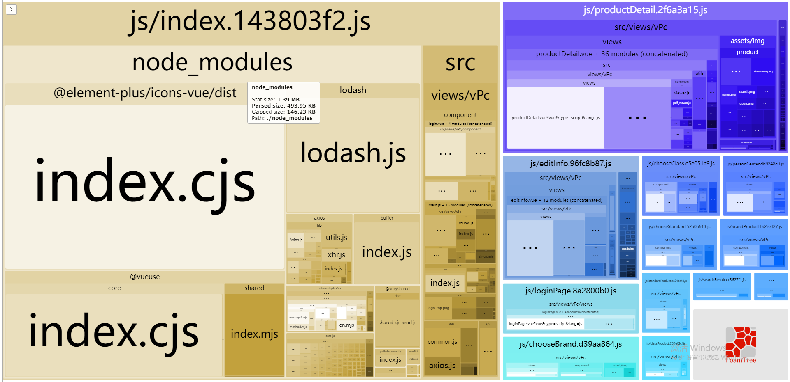

## 如何进行资源分析


### 一，使用--report，--report-json等包分析

> 说明：公共vue框架的vue-cli脚手架版本已经支持包分析，不需要再安装包分析工具。

参考代码：

```json
"build": "vue-cli-service build --report --report-json",
```

分析结果截图：



### 二，控制台查看资源请求

> 说明：通过NetWork查看页面实际运行时的资源加载情况

示例截图：

​	

## 如何减少资源请求，优化加载体验


### 一，使用gzip压缩打包资源

> 说明：在项目中配置gzip压缩资源，可以减少网络请求资源大小，压缩后文件大小一般为原文件的30%左右。

代码参考：

```js
// npm安装gzip压缩工具
npm i compression-webpack-plugin@5.0.2 -D

// vue.config.js中进行配置
// 1,引入依赖包
const CompressionPlugin = require('compression-webpack-plugin');
// 2,在configureWebpack中进行配置
configureWebpack: config => {
    config.plugins.push(
      new CompressionPlugin({
        filename: "[path].gz[query]",
        algorithm: "gzip",
        test:  /\.js$|\.html$|\.css$/,	// 压缩文件类型
        threshold: 10240, // 只有大小大于该值的资源会被处理 10240
        minRatio: 0.8, // 只有压缩率小于这个值的资源才会被处理
        deleteOriginalAssets: false, // 删除原文件
      })
    );
}
```

```js
// nginx配置
http {
    include       mime.types;
    default_type  application/octet-stream;
    sendfile        on;
    #tcp_nopush     on;

    #keepalive_timeout  0;
    keepalive_timeout  65;

    gzip_static on;

    server {
        listen       8462;
        server_name  localhost;

        location / {
            root   dist;
            index  index.html index.htm;
        }
        error_page   500 502 503 504  /50x.html;
        location = /50x.html {
            root   html;
        }
    }

}
```

压缩js参考截图：


网络请求截图：


### 二，路由懒加载

> 说明：路由懒加载可以设置成切换路由时才请求页面资源，对于较大的项目是必要的

代码参考：

```js
  {
      path: '/home',
      component: () => import('../home.vue'),	// import导入的路由模块会被脚手架解析成单独模块
  },
```

### 三，element-plus等UI框架优化

> 说明：ui框架也是项目中资源大小占较大的模块，对于越轻量的项目越有必要优化

1，element-plus按需引入

> 说明：通过配置项自动解析element-plus使用的资源

代码参考：

```js
// 依赖安装
npm install unplugin-auto-import@0.8.8 -D
npm install unplugin-vue-components@0.20.1 -D

// vue.config配置
configureWebpack: {
    plugins: [
      AutoImport({
        resolvers: [ElementPlusResolver()],
      }),
      Components({
        resolvers: [ElementPlusResolver()],
      }),
    ],
},
  
// main.js中去掉ElementPlus的注册资源
// import ElementPlus from 'element-plus'
// import 'element-plus/dist/index.css'
// .use(ElementPlus)
```

对比参考截图：


2，element-plus独立成三方资源

> 说明：element-plus拆分成三方资源后放置cdn可以减小项目当前服务器的压力，拆分成三方资源后能享受到浏览器缓存

代码说明：

```js
// main.js中去掉ElementPlus的注册资源
// package.js中去掉element-plus的依赖
// index.js中引用element-plus资源
<link rel="stylesheet" href="https://viewertest.tuzhitong.com/ndsource/element-plus-2.3.5.min.css">
<script src="https://viewertest.tuzhitong.com/ndsource/element-plus-2.3.5.min.js"></script>
```

### 四，vue相关资源分离出项目
> 说明：在项目中可以将vue，vuex，vueRouter分离出项目包，作为三方资源在index.js中引入

代码参考：
```js
// vue.config.js中进行配置
chainWebpack: config => {
  config.set('externals', // 设置vue相关资源分离出项目
    {
      'vue': 'Vue',
      'vue-router': 'VueRouter',
      'vuex': 'Vuex'
    }
  );
}
```

### 五，其它三方资源分离出项目

> 说明：在项目中去除依赖包，在index或对应组件中进行动态加载

参考代码：

```js
// index.js中进行引用示例:
<script src="https://viewertest.tuzhitong.com/ndsource/html2canvas-1.4.1.min.js"></script>
// 代码动态创建script标签引入js，参考方法：
function seriesLoadScripts(scripts, callback) {	// 动态引入js资源
  if (typeof scripts != "object") var scripts = [scripts];
  var HEAD = document.getElementsByTagName("head").item(0) || document.documentElement;
  var s = new Array();
  last = scripts.length - 1;
  recursiveLoad = function (i) {
    s[i] = document.createElement("script");
    s[i].setAttribute("type", "text/javascript");
    s[i].onload = s[i].onreadystatechange = function () {
      if ( !(/*@cc_on!@*/ 0) || this.readyState == "loaded" || this.readyState == "complete" ) {
        this.onload = this.onreadystatechange = null;
        if (i != last) recursiveLoad(i + 1);
        else if (typeof callback == "function") callback();
      }
    };
    s[i].setAttribute("src", scripts[i]);
    HEAD.appendChild(s[i]);
  };
  recursiveLoad(0);
}
seriesLoadScripts(["https://viewertest.tuzhitong.com/ndsource/html2canvas-1.4.1.min.js"], () => {
	console.log('资源加载完成');
})
```

package.js中去掉依赖，参考截图：


### 六，图片优化

- 图片压缩，压缩网站示例：[https://docsmall.com/image-compress](https://docsmall.com/image-compress)
- css绘制替换图片
- v-if控制默认不显示


### 七，去除预加载、闲置加载

> 说明：vue-cli可能会将资源打成预加载或闲置加载模式模式，闲置资源看link标签是否有prefetch，预加载看script标签是否有preload

代码参考：

```js
chainWebpack: config => {
	config.plugins.delete('prefetch-index');	// 去掉闲置加载
  config.optimization.delete("splitChunks");	// 去掉自带分割功能
  config.plugins.delete('preload-index');		// 去掉预加载
}
```

打包后index.js对比参考截图：


### 八，其它优化项
1, 去除sourcemap

```js
// vue.config.js
productionSourceMap: false,
```

2，限制图片打包进js
```js
// vue.config.js
chainWebpack: config => {
  const imagesRule = config.module.rule("images");
  imagesRule.use("url-loader").loader("url-loader").tap((options) => Object.assign(options, { limit: 1, esModule: false, })); // 原配置
},

```
3，去掉打印信息
```js
// vue.config.js
chainWebpack: config => {
  config.optimization.minimizer[0].options.terserOptions.compress.drop_console = true;
},

```
4，白屏优化
```js
// index.js
<div id="app">
  <!-- 创建loading或骨架标签 -->
</div>

```

